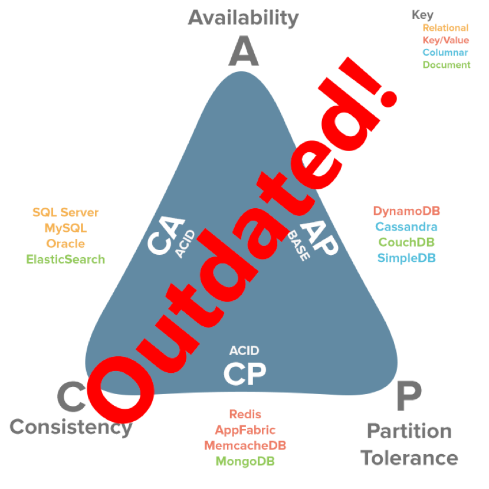
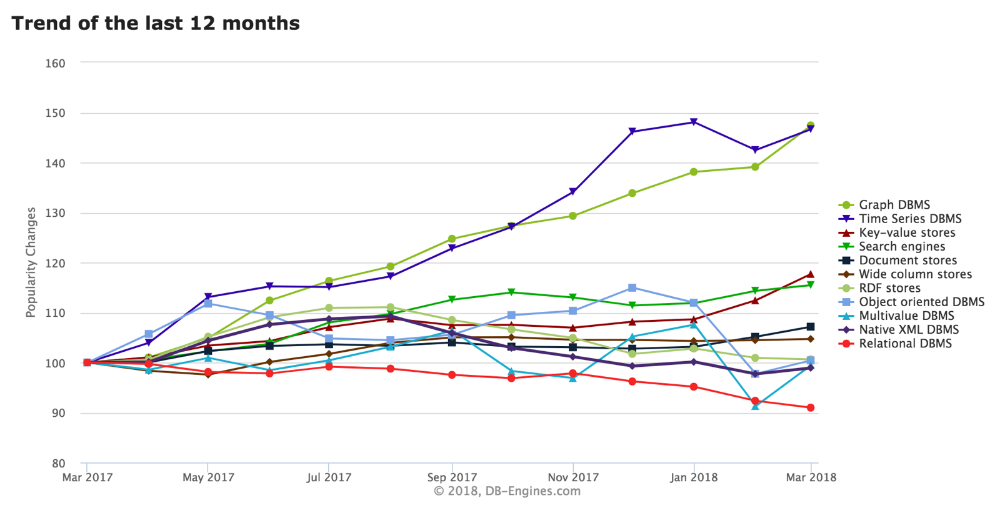
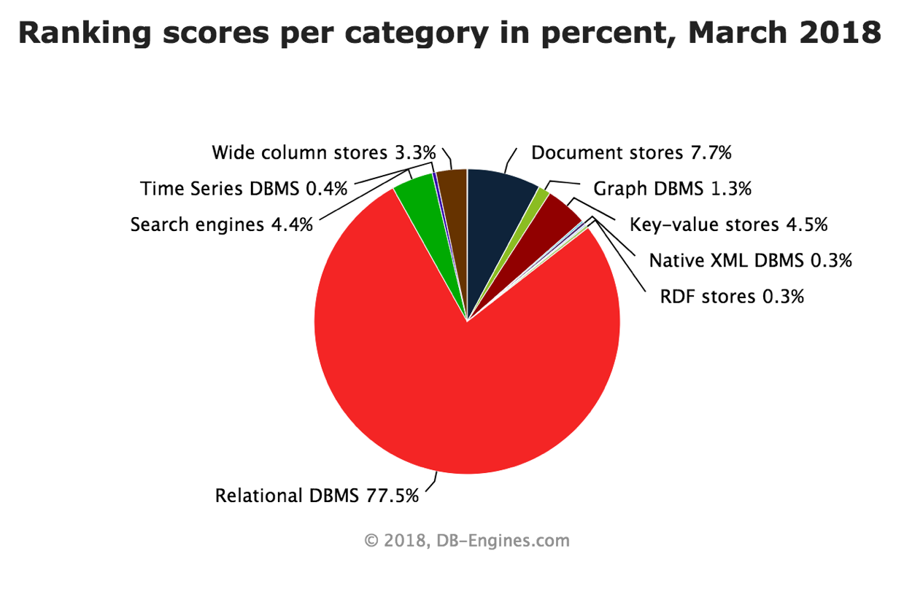
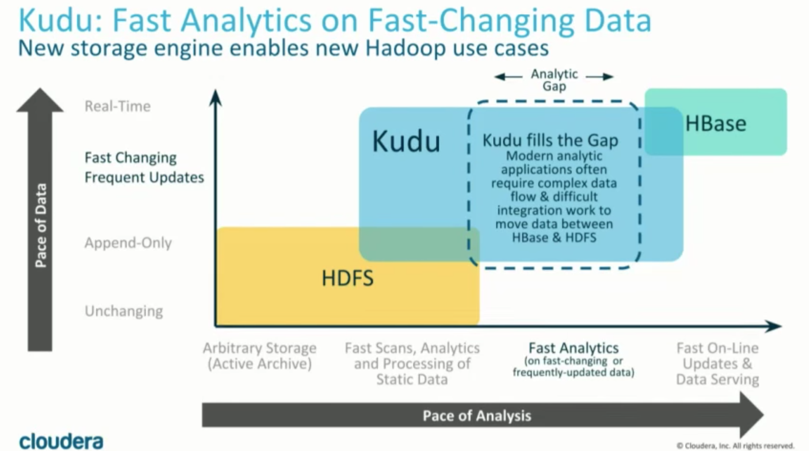

# Database Research

## Ranting my Frustrations as an Engineer

It is this developer's personal opinion that we're at the point that these labels have such far-reaching implications that the zeitgeist has stripped the definitions from all meaning.

Eventual Consistency, High Avalibility, Physical Partioning, Hadoop, Hive, Pig, Sharding, **BIG DATA**. We once lived in a world where SQL was the only palletable flavor for data storage. In the past few years the volume of vocabulary in Computer Science has finally started to match the implications of a world interconnected by technology.

Here's some statements that I have heard in my short time in tech:
 * I have a searchbar so I need Elastic Search
 * All data is time-series data. We should put our data into TimeSeries DB.
 * Graph Databases are best for representing any relationships
 * MySQL is not for big-data

## Engineering Philosophy

Solid engineering fundamentals tells us that is more important to understand the pros-and-cons for every technology than it is to know one standard really well. Keep in mind that engineering always starts as the problem; you don't really need to know how every technology works in depth in order to understand when to apply it.

This is a controversial statement for a lot of academics, but most folks that use hash-maps every day have little understanding of the underlying nuances this data-structure in [a typed vs a dynamic language](https://developers.redhat.com/blog/2017/02/27/towards-faster-ruby-hash-tables/). O(1) Lookup and unique elements is all you *really* need to know about a hash in any language; the rest will rarely ever come in handy.

In other words, start with a bread-first look at any problem; including databases.

## Step 1 - Understanding Vocabulary

###  NoSQL vs SQL
Let's keep this relatively simple. SQL is one of the oldest technologies that we have in CS, and I mean that as a generally positive thing. When I think of relational schemas, I think of inituive and easy-to-deploy technologies that have been optimized to the nth degree, and are the defacto standard for 90% of use cases. I should note that there's an old-school mentality that argues that SQL can do it all, and it's mostly rooted in truth. Generally the strategy is to start here, and move to other alternatives based on necessity.

NoSQL is a general bucket that denotes practically everything else on this list that doesn't fit in the category of Relational DBMS. Perhaps the data you're looking at is too large, decentralized, unstructured, timely, or relationship-centric for SQL to be your #1 choice. So keep an open mind and step forward into the world of DBs.

### ACID-ity
Oh boy, more acronyoms. These 4 letters denote the properties that are so coveted about databases, and what makes them different from reading/writing to a CSV on your HDFS. Keep in mind that Data is precious, and thus the technologies we entrust to carry them must have certain protections.

**Atomicity** - "All or nothing" transactions. If the 99th mutable query fails in a series of 100, then I'd rather "rollback" the effects of the previous 99 queries than to encounter a half-completed state.

**Consistency** - Databases transition from one valid state to another; always respecting its own rules and constraints. No such "half-true" states.

**Isolation** - A database is allowed (and should be) multithreaded, but transactions should be executed as if encountered one-by-one. This means that 'conflicting' queries must be either resolved or terminated.

**Durable** - Once a transaction is commited, it will be stored perminantly. Whether in the case of power loss or errors, my data remains safely and durably stored.

### Brief and shallow look into SQL Scaling
"Scalability" is another one of those words that has lost all meaning because it just means everything. I'll try to skim the surface here, as to not drown this entire article with caveats, exceptions, and expectations. Suppose that my current database is starting to reach the extents of its tolerance. I can choose to react in one of two ways.

(A) If my problem is a memory problem then maybe I buy bigger and/or better RAM. Say I have a reading or writing problem, then maybe I buy bigger and/or better harddrives and implement RAID 0 on my servers. If I'm using a cloud-service with Azure/AWS/Google then maybe I give them money for a bigger and/or better server. This is what we call **Vertical Scaling**, because I'm throwing money at my one server, thus dodging the issue entirely. If done well, this can get you a lot of milage.

(B) If I'm using a traditional SQL solution, the absolute last thing I want to do is **Horizontal Scaling**. At best this means that I implement a leader-follower replication system on my servers to prospone the issue. At worst this means that we have to go full-blown denormalization and sharding; which (while entirely possible) SQL does not handle gracefully. Quite arguably, this is one of the biggest arguments against SQL in the modern 'web-scale' era.

### Scheme-on-read & Data Lakes
A lot of Apache's new databases are built on top of Hadoop File System (HDFS) such as Hive, Kudu, and HBase. The premise here is that you have a massive body of unstructured, raw data that gets stored into a file system. This data continually stacks up without being processed until we actually need it to be processed.

In a traditional database, a strict structure would be imposed immediately on incoming data; this is called schema-on-write and it trades write performance for fast reads. Schema-on-read will create meta-data for a file's structure only upon reading the file; thus speeding up writes.

### The One-Thousand Year Storm
In Civil and Environmental engineering there is this really nifty concept of the "100-year storm". Contrary to popular belief this does not mean that you should design a drainage system to accomodate 100 years worth of rain; that would be quite wasteful. The idea is to take the worst percipitation that you had to endure in the past 100 years in a given region, and see how your system handles under that stress.

LeanTaas's 100 year storm is about 15 mb of data per day per region. We multiply this by some factor of safety, say 3, and we should anticipate 45 mb worth of data per day. In 10 years we should anticipate ~165GB in our raw-feeds table per region. Hospitals can have up to three regions, so I should be stress testing by querying 15mb of data on a table that contains about ~500GB worth of data. Keep in mind that big-data technologies can handle petabytes of information; I think half a TB is far from "big data" on its own.

## Step 2 - **C**onsistency, **A**valiability and **P**artition Tolerance

**Consistency** - A read executed on any node will return the same result. Not to be confused with ACID's consistency.

**Availability** - Every request gets a response from the client despite success or failure in a reasonable amount of time.

**Partition Tolerance** - Horizontal scaling, by adding or subtracting more physical partitions, does not cripple the system. This is what people talk about most when they bring up 'web-scale' and 'sharding'.

* *Note*: For more information, take a peak at [Robert Greiner's article on the CAP Theorem](http://robertgreiner.com/2014/08/cap-theorem-revisited/)

Once upon a time the CAP theorem was proposed as a standard for choosing databases. The basic premise was that you can only pick two from the three 
DB properties, and there was no such thing as a perfect solution. SQL traded 'P' for 'C' and 'A', and NoSQL technologies were each either trading 'C' or 'A' to get 'P' back.

Such a theory was relevant back then, but now we like to say that the tradeoffs between 'CAP' are technology-specific. Sorry, but choosing a database just became a lot less binary.

One such reason why such a theorem was considered popular was because of the assumptions we placed on distributed computing and networking back then, and another attributes the change to revolution beyond SQL. In any case, you should still prioritize. Try to rank the three properties in order of importance to your needs. This will certainly come in handy down the line.

## Step 3 - Start with Categories, not Models
In order of popularity, here are the different types of databases **CATEGORIES**:
1) **Relational DBMS** - We all know and love RDBMS's; perhabs a bit too much
2) **Document Stores** - Specifically intented to solve the problem of storing and querying unstructured data. It doesn't really make sense to have a column with 1 million nulls and 1 value, because relational databases are optimized to read from left-to-right, and top-to-bottom. Document stores are often denormalized by design, and thus are argued to scale better than SQL systems (I'm oversimplfying a bit here). 
3) **Key-Value Stores** - Really good if the primary index for quering is, and will only be, based on a primary key. These stores don't need a large query interpreter, and are great for storing and scanning large structured/unstructured data quickly in real-time with great simplicity. 
4) **Search Engines** - Support for complex search expressions through full-texts grouped, filtered, and ranked results with high scalability.
5) **Wide Column Stores** - Columnar databases work really well for scans or really-large data sizes. The large amount of columns means that all joins must be done post-query.
6) **Graph DBMS** - Graph Databases are relation-ship driven databases that use a hybrid of database models to accomplish a graph-like association. LeanTaas, the company I work for, uses Graph databases to model the complex administrative hierarchies that are commonly found within hospitals. I have to say, this sure beats the hell out of having hundreds of SQL junction tables for sparse relationships.
7) **Time Series DBMS** - If the primary of all incoming information is a datetime object such that newer infromation is prioritized over older entries.
8) **RDF Stores** - Stores tuplets (AKA semantic graph databases) use a subject-predicate-object definition to define relationships. The best way I can describe the power of modeling data via human language is by example: "Bob is Joe" or "Joe likes John". The subject is the starting node, the predicate is the edge, and the object is the ending node. Unlike Graphs, Verticies and Edges here have no internal structure, and are thus really efficient to query and traverse based purely on relationships.
9) **Native XML DBMS** - I'm choosing to ignore this
10) **Multivalue DBMS** - I'm choosing to ignore this
11) **Object-Oriented DBMS** - Meant to store/load object-oriented models directly to/from a database. I'm choosing to ignore this
12) **Content Stores** - I'm choosing to ignore this
13) **Navigational DBMS** - I'm choosing to ignore this
14) **Event Stores** - I'm choosing to ignore this

Generally speaking, technologies hire on this list overlap with use-cases than technologies lower on the list. For example, it is possible for SQL technologies to store a lot of the relationships that Graph DBs and RDF stores are adept at, and Document Stores can persist object-oriented meta-data rather quite nicely. However, that the later also exist for their own reason. *The Principle of Sufficient Reason* argues that if it exist, then there must be a reason. Applied to Databases, this can be interpretted as "if it exists, then it must do something that standard SQL does not do well". 
Alright, do you have an idea of what you want now? Let's start by figuring out what people have been talking about. I once again remind the reader of the principal *The Principle of Sufficient Reason* for databases; if it exists then it does something that standard SQL doesn't do well.

### Visualizing the Zeitguist as of 2018

**Note:** All Charts and graphs were borrowed from [db-engines.com](https://db-engines.com/en/ranking_categories); which is a really cool website that you should check out

Some Observations:
Understandably, with the increasing popularity of IOT, Time Series DBMS's are becoming a bit more popular. This type of database allows for high throughput of time-indexed data such that older data is less prioritized than newer data.

Columnar (Wide-Column) Databases, Key-Value stores, and Document stores are the epitome of what people mean when they talk about "NoSQL" solutions, because none of these technologies need or use joins. Key-Value stores are great if you only query based on one primary key, and nothing else. Document stores are fantastic for unstructured data. Columnar databases are well designed to scan large  data-sets of data from top-to-bottom rather than from left-to-right.

## Step 4 - Technologies and Models

### Data Lake Applications
#### Apache Hive
Schema on Read File Store, rather than Schema on write
Taking existing data on the cluster and applying meta-data as its read in with managed & external data.
High Read / Write Throughput directly on an HDFS
Not meant for high availability, or being hit with multiple queries simultaneously
Not great with partioning
#### Apache HBase
Columnar-Oriented Database; good for fast analytics on sparse datasets (meaning null/meaningless rows are expected)
Each table must have a primary key, and all attempts to access a row must use this primary key
Intended for sequential reads/writes, and data-lake applications. Runs on top of HDFS. More anaylitics-friendly.
#### Apache Cassandra
NoSQL rather than columnar database; instead it writes based on designated keyspaces and column-families.
Still reads right to left, up to down; not columnar database. Not great with sparse datasets.
Intended for high availability and constant queries. Consistency is made second, but Cassandra can be configured for high consistency.
Intended for random-access, always-on applications
#### Apache Kudu
* Fast Analytics on Fast-Changing Data
* Sacrifices on high avaliability (a bit more than HBase) for write throughput
* Unlike HDFS this allow for more than append only operations (i.e: upserting)
* As of 2018 this is a newer database with high potential.
#### Apache Presto
* Good when data lives outside of HDFS
* Rather than consequtive reads from HDFS; data is piped from one machine to another.
* A lot of optimization done to minimize the piping of data
* You can implement APIs that expose underlying parallelism of the external data sources in Java. Presto will then optimize based on these implementations. This is what AWS did with S3 to create AWS Athena.
#### Amazon RedShift + S3
* S3 is a distributed file store as a service, and RedShift is a Columnar-Oriented Database. Amazon provides a service that inserts S3 files onto RedShift in a highly parallized manner.
* Amazon also provides Apache Spark integration with RedShift.
* The analogy to HDFS and HBase can most certainly be made; with [pros & cons constantly being added to both sides](https://www.xplenty.com/blog/hadoop-vs-redshift/)

#### How to Decide between Data Lake Applications

On The Very Left we have HDFS w/hive for basic query-on-read abilities. In order of most available to least the Hadoop DB stack goes: Hive, Impala/Presto, Kudu, then HBase.

Hive is schema on read built on map reduce & HDFS. We've talked about Hive enough, but it's meant for long-running tasks over large amounts of data. It's not really meant for speed.

Impala is meant for OLAP workloads, in the hadoop ecosystem and it supports the random query here and there. Not really meant for long-running tasks.

Presto is meant for OLAP workloads if data is stored outside of HDFS. I use this technology a lot; it's pretty nifty. In fact, AWS Athena is actually just Presto underneath the hood!

Next we have Apache Kudu which bridges the gap between fast changing data and highly available analytics on that data. It's meant for analytical (non-available) workloads, and is a truly columnar format.

After that we have HBase, which is good for strongly consistent and partition-friendly analytics on data with decent availability. It's better with random access of data than everything else, but this is still not intended to be used for web-facing applications that need high availability. This technology only makes sense if you're dealing in the literal petabytes of data, and are doing large sequential scans.

Cassandra goes off the scale to the far right where availability is valued higher than consistancy. However, take the CAP theorem with a grain of salt because you can configure Cassandra to value consistancy over speed. However, the end result is to use Cassandra if you're looking for a NoSQL, highly available, web-facing database that can handle large PBs of data. However, Cassandra is not great with large singular scans.

In AWS terms, you have the S3 + Redshift alternative to all these Apache technologies. S3 is not quite like HDFS, but can function similarly. RedShift is not quite like HBase, but is highly available and strongly consistent for large scans with columnar analytics.

