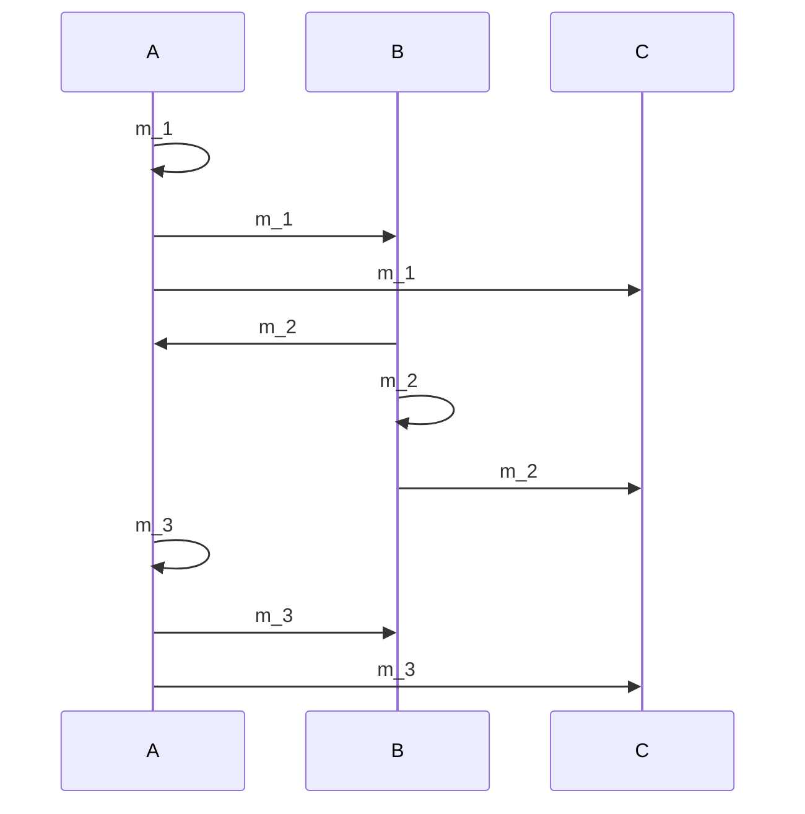
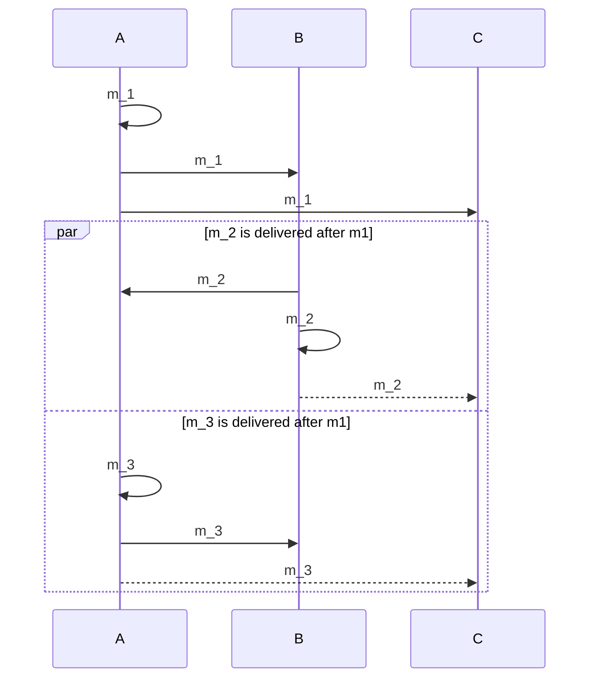
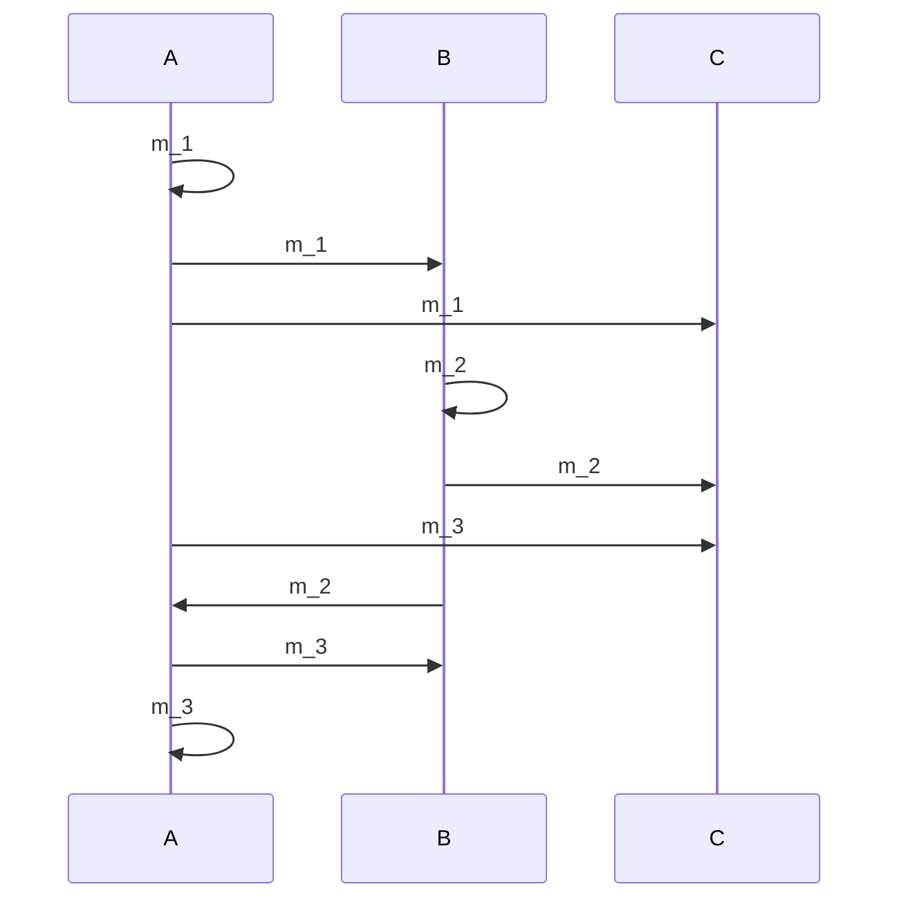
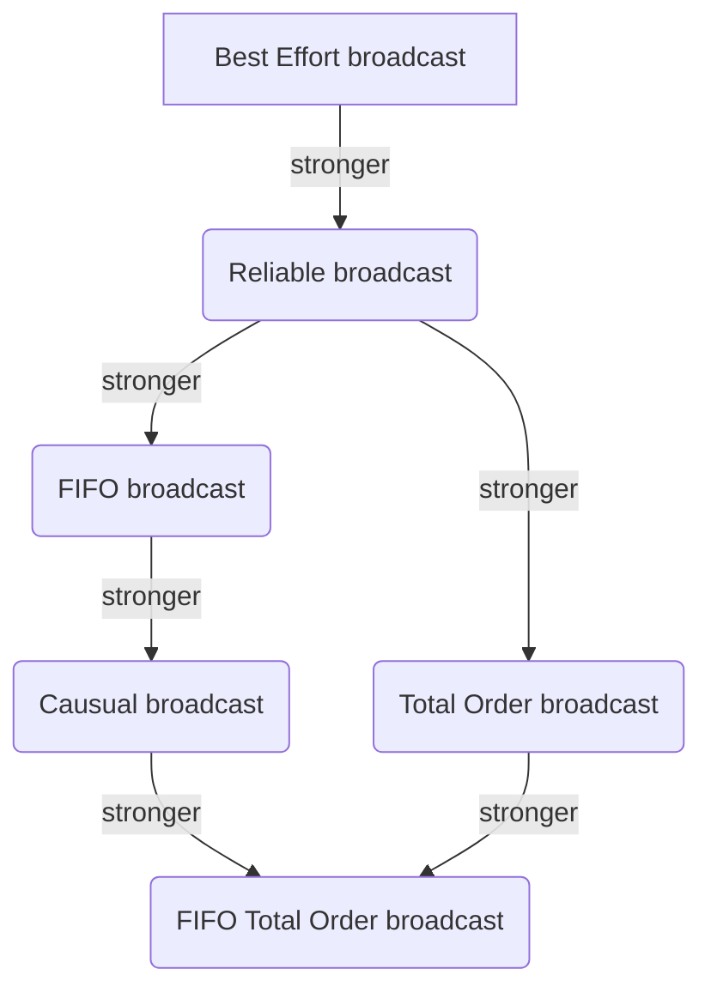
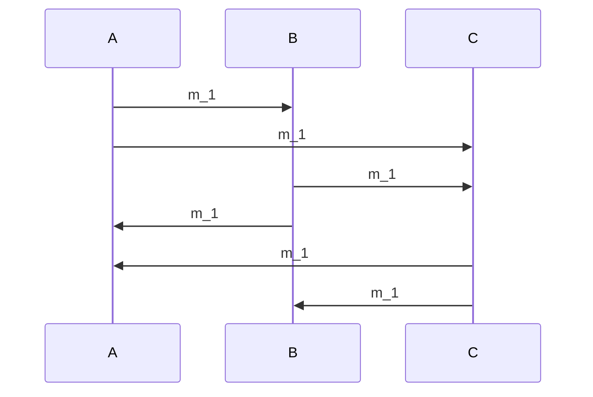

# Distributed Systems - Martin Kleppmann
[youtube lecture series link](https://www.youtube.com/watch?v=y8f7ZG_UnGI&list=PLeKd45zvjcDFUEv_ohr_HdUFe97RItdiB&index=6)

### 1.3: RPC
* You know this, but it's cool to put together vocab.
* An RPC is a Remote Procedure Call. It's a way of calling a method on another machine, and maybe another programming lang.
* A "stub" is a method signature; frequently written in a language-agnostic format called...
* "IDL" interface definition language
* Marshalling is serializing data to an encoding. text/json/binary etc. 
* RPCs supported by the Web are HTTP/HTTPS/WebSockets, and the REST convention of designing HTTP endpoints.
* RPCs not supported by browsers are everything else: GRPC namely
    * Java RMI, SOAP, FB's Thrift, etc.

### 2.1/2.2: Two Generals & Byzantine Generals
* **Two Generals**: We assume nodes are honest, and want to coordinate to attack a city.
* **Byzantine Generals**: We assume nodes are dishonest, and want to coordinate to attack a city.
    * There must be 3f + 1 generals in order to tolerate f malicious generals
    * < 1/3 of the generals can be malicious

### 2.3: System Models
* **Network Models**
    * **Reliable** = perfect
    * **Fair loss** = messages may be lost, duplicated, or reordered.
    * **Arbitrary** = A malicious adversary may interfere with messages reliability & order & authenticity. 
    * Use cryptography (i.e TLS) to make Arbitrary into Fair Loss. 
    * Most real-world networks are fair-loss.
* **Node Models**
    * **Crash-stop** (fail-stop)= after crashing it stops forever
    * **Crash-recovery** (fail-recover)= a node may crash; losing its memory state, but then recover later. Or maybe not.
    * **Byzantine** (fail-arbitrary)= it deviates from the algo. Untrustworthy in execution. Example: client-side JS.
* **Timing Models**
    * **Synchronous** = message latency has a hard-upper bound. Example: Google's Spanner DB or Cockroach DB.
    * **Asynchronous** = Messages can be delayed arbitrarily. Nodes can pause execution. No guarentees at all.
    * **Partially Synchrounous** = the system is mostly synchronous, but potentially asynchronous
* Big lesson: Make responsible assumptions in this space! If you don't, your algorithms might fail catastrophically.
* Most HTTP systems are Fair-Loss; with known/assumed client-side Byzantine browsers; and are partially synchronous.

### 2.4: Fault Tolerance
* The Nines
    * "2 nines" = 99% up = down 3.7 days/year
    * "3 nines" = 99.9% up = down 8.8 hours/year
    * "4 nines" = 99.99% up = down 53 min / year
    * "5 nines" = 99.999% up = down 5.3 min / year
* **SLO** = Service-Level-Objective "99.9% of requests get a response in 200ms"
* **SLA** = Service-Level-Agreement "contract specifying some SLO, penelties for violation"
* Fault vs Failure
    * Failure = system isn't working as a whole.
    * Fault = some parts of the system that aren't working (node/network)
    * Fault tolerance = system as a whole continues working despite some fault.
    * Single Point of Failure (SPOF) = node/network link whose fault leads to failure
* Failure Detector
    * Failure Detector: Algo that detects when another node is faulty
    * Perfect failure Detector: Algo detects iff crash
    * Typical implementation: send message, wait response, label node as crashed if no reply w/i timeout.
    * Problem: can't tell the difference between crashed node, unresponsive nodes, lost message, or delayed message.
    * **Eventually Perfect**: A node can stop being responsive temporarily, but eventually it labels a node as crashed iff it crashed.

* Big lesson: Have a business strategy to recover when all fails. 
    * i.e: in Chess: refund ELO/refund time/appease customers
    * i.e: in payments: refund the payment and do not allow the seller to ship goods.

### 3.1: Physical Time, 3.2: Clock Sync, 3.3: Causality
* UTC is an absolute mess from a computer's perspective due to the nature of relying on cosmic observations and time skew.
* Time smearing is how some clocks account for leap-seconds. Rather than add/delete a second suddenly, it just smears it across a boundary. Meh, not perfect, works for now.
* Clock drift exists for completely legit reasons. Temperature, physics, and hard-to-control variables.
* Computer local clocks are made from quartz, kinda cool.
* Computer local clocks are not made from atomic measurements. That would be expensive.
* That means that clock drift occurs even with NTP
* **NTP**: Network time protocol based on TCP. It syncs the time.
* Stratum is how we measure accuracy of NTP.
* Stratum 0: Atomic clock measured. Stratum 1: Syncs with an atomic clock. Stratum 2: syncs with stratum 1. Stratum N: etc.
* **Causality** comes from physics. "A happens before B". Sometimes A does not observe B, or vice versa, so therefore we say that "A is *concurrent* with B".
* Standard clocks are not monotonic. They do not move only in 1 direction!

### 4.1: Logical Time
* In distributed systems we need to a bit better than logical clocks in order to add relative ordering. There are two systems for this: Lamport and Vector.
* Lamport timestamps have limitations. Given L(a) and L(b), the timestamp of event A & B, you can only say "not b->a". You can't say "a->b" or "a || b". Vector clocks solve this.
* **Lamport Algo**: For every local event sent increment the timer. When received set the timer to the max of that timestamp or your timestamp. 
* **Vector Algo**: There is a vector of length N for N number of nodes. For every local event sent, increment the timer for your part of the vector. When a sync happens, max the index of the vector related to the node.

### 4.2 Broadcast
* Broadcast = group communciation. 
* The web is built on unicast from point-to-point, but on top of that we can build broadcast protocols.
* **best-effort**= may drop messages
* **relaiable**= non-faulty nodes deliever every message by retransimitting dropped message
* **async**= no upper bound on message latency.
    * FIFO-total order broadcast. FIFO broadcast + total order broadcast.
        * if b(m1)->b(m2) & b(m1)->b(m3) then 

#### FIFO Broadcast
if m1 and m2 are brodcast by the same node and b(m1)->b(m2), then m1 must be delievered before m2.
Messages sent by the same node must be delievered in the order they were sent.
Messages sent by different nodes can be delievered in any order.
It does not ensure order across nodes. m1,m2 on node A is valid but m2,m1 on node B is also valid.

in example, m1 must arrive before m3, but m1 and m2 are communicative. (m2,m1,m3) or (m1,m2,m3) or (m1, m3,m2)


#### Casual Broadcast
if b(m1)->b(m2) then m1 must be delievered before m2.
Casaul order is guarenteed. 

In example, b(m1)->b(m2) & b(m1)->b(m3). So m2 cannot be delievered before m1, and m3 cannot be delievered before m1. However, m2 and m3 are interchangable. Valid orders are m1,m2,m3 and m1,m3,m2. 



#### Total Order Broadcast
If we require that all nodes agree on the same order.
If m1 is delievered before m2 on one node, then m1 must be delievered before m2 on all nodes.
If b(m1)->b(m2) & b(m1)->b(m3) then Valid orders are m1,m2,m3 OR m1,m3,m2. However, all nodes must must have the same order.

In example, notice that every node gets m1, m2, and m3 in that exact order. This means that A had to delay broadcasting to itself.


#### FIFO Total Order
Total Order, but in a single sender if m1 is delievered before m2 then this must also happen for all nodes.

#### Weakest to strongest broadcasting


### 4.3: Broadcast Algos
**Eager reliable broadcast**: (Brute force) Everyone sending messages everywhere.
Look at how message m_1 is propogated by every node to every other node unless they already propogated it.
* Pros: great reliability
* Cons: Terrible cost of network bandwidth


**Gossip Protocols**
* example: Each message is sent to 3 other nodes at random. Eventually reaches all nodes (with high probability).
* Pros: Less expensive than eager broadcasting, while still being reliable.
* Cons: Less reliable than eager. A lot of parameters you have to tune based on your use-case.

**FIFO broadcast algo**
```python
def init():
    send_seq: int = 0  # increment per send
    delievered: list[int] = [0...0]  # how many messages per sender we've delievered
    buffer = queue()

def on_req(n: Node, m: Message):
    send_reliable_broadcast((n, send_seq, m))
    send_seq += 1

def on_recv(sender: Node, m: Message):
    buffer.append(msg)
    while has_messages_ready_to_be_delievered():
        deliver(buffer.pop_msg())
        delievered[sender] += 1

def has_messages_ready_to_be_delievered(sender: Node):
    for msg in buffer:
        if msg.order === delievered[sender + 1]
            return True
    return False
```

**Causual Broadcast algo**
```python
def init():
    send_seq: int = 0  # increment per send
    delievered: list[int] = [0...0]  # how many messages per sender we've delievered
    buffer = queue()

def on_req(n: Node, m: Message):
    deps = list(delievered)
    deps[i] = send_seq  # minor diff is that we don't send seq_num but rather the whole depedency arr
    send_reliable_broadcast((n, deps, m))
    send_seq += 1

def on_recv(sender: Node, deps: list[int], m: Message):
    buffer.append(msg)
    while has_messages_ready_to_be_delievered():
        deliver(buffer.pop_msg())
        delievered[sender] += 1

def has_messages_ready_to_be_delievered(sender: Node, deps: list[int]):
    # any message who's causual dependencies have been satisfied
    # return deps <= delievered  # this is vector-clock-like-comparison
    return all([deps[i] <= delievered[i] for i in range(len(deps))]) 
```

**Total Order algo**
* Single Leader Approach: You need a leader to decide the canonical order across systems. You need consensus (i.e: Raft) to make this approach work across replicas.
* Lamport clocks Approach: lamport timestamps have an associated total order. It's a bit conceptually complicated, here is the [video timestamp](https://youtu.be/77qpCahU3fo?t=787). However, it's not fault-tolerant

### 5.1 Replication
* Replication = keeping a copy of data even if the nodes are unavailable.
* RAID = multiple hard disks to redudently store data on >1 HDD. (RAID 1 in particular and nested raids).
* **IDEMPOTENCE** = important concept! Applying a func once has the same effect as applying it multiple times.
* Retries:
    * At most once = send request, don't retry, update may not happen
    * At least once = retry until request is ack'd
    * Exactly once = retry + idempotence or deduplication
* Adding & removing from a set has the problem of consistency. How to solve?
* **IMMUTABILITY** via tombstones. When a thing is removed, you add a tombstone + logical timestamp. Same during addition. This is how you can mutate a set, is by making it immutable. He doesn't talk about this, but the set data-structure is a CRDT (conflict-free replicated data).
* Concurrent writes by different clients: can use LWW (last writer wins) or Multi-value register (use timestamps with partial order, keep multiple values if concurrency occurs).

### 5.2 Quorums
* The more nodes the higher probability that at least one of them is crashing.
* You might want Read-after-write consistency. You can solve this problem with a quorum.
* In a quorum, you can set the level of consistency & availability by writing with acks to w replricates.
* RW Quorums with n replicates:
    * write to w replicates
    * read to r replicates
    * and r + 2 > n
    * Read quorums and write quorum share >= 1 replica
    * Fault Tolerance: Reads can tolerate n - r unavailable replicates, writes n - w
* Read repair: get replicas back in sync. If a reading a value returns an outated value from 2 out of 3 replicas, you can update those replicas with the correct value.

### 5.3 State Machine Replication
* FIFO total roder broad every update to all replicas
* A state machine will end up in the same state after applying the same sequence of messages. 
* If we have FIFO-Total-order broadcast we have this
* Serializable transactions (execute in delivery order)
* closely related ideas: Blockchains, distributed ledger, smart contracts
* Limitations: cannot update state immediately have to wait for delivery through broadcast. A replica cannot immediately update their own state.
* Database leader replica: Leader database replica ensures total order boradcast, all followers just copy what the leader says. This is basically state-machine replication
* Can we use weaker broadcast algos (like Causal broadcast, fifo-broadcast) to implement replication? Yes!
    * if replicate states are deterministic (SMR), **total-order** broadcast is OK!
        * example: a set with deletes.
    * if replicate states are deterministic & concurrent updates communitive (f(g(x)) == g(f(x))), then **causual** broadcast is OK!
        * example: Operational transforms on strings
    * if replicate states are deterministic & all updates commute, then **reliable** broadcast is OK!
        * example: append-only set
    * if deterministic, commutative, idempotent, tolerates message loss, then **best-effort** broadcast is OK!

### 6.1 Consensus
* Total Order Broadcast requires consensus. The consensus will guarentee that all the nodes agree on the same node order.
* Total Order Broadcast & consensus are fully equivalent. If you have one you can convert it to other.
* Big Algos: usually assume a partially synchronous crash-recovery system model.
    * Paxos
    * Multi-Paxos
    * Raft, Viewstamped Replication, Zab
* FLP result (Ficher, Lynch, Paterson): Proof that there is no deterministic consensus algo that is guaranteed to terminate in an asynchronous crash-stop system model.

**Leader Election**
* "split brain" is when there is 0 or 1 leader per term
* Failure detector (timeout) to determine suspected crash
* A **term** is a unit of time.