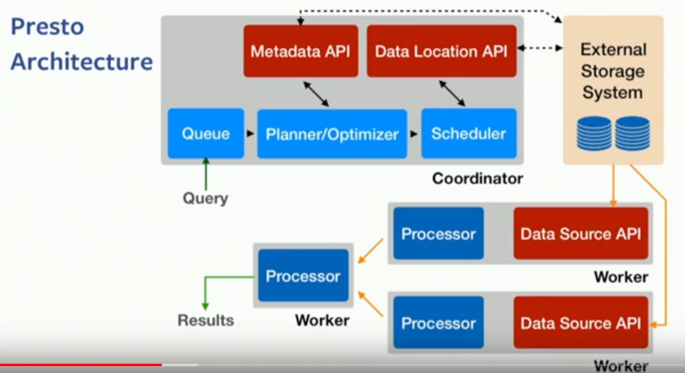
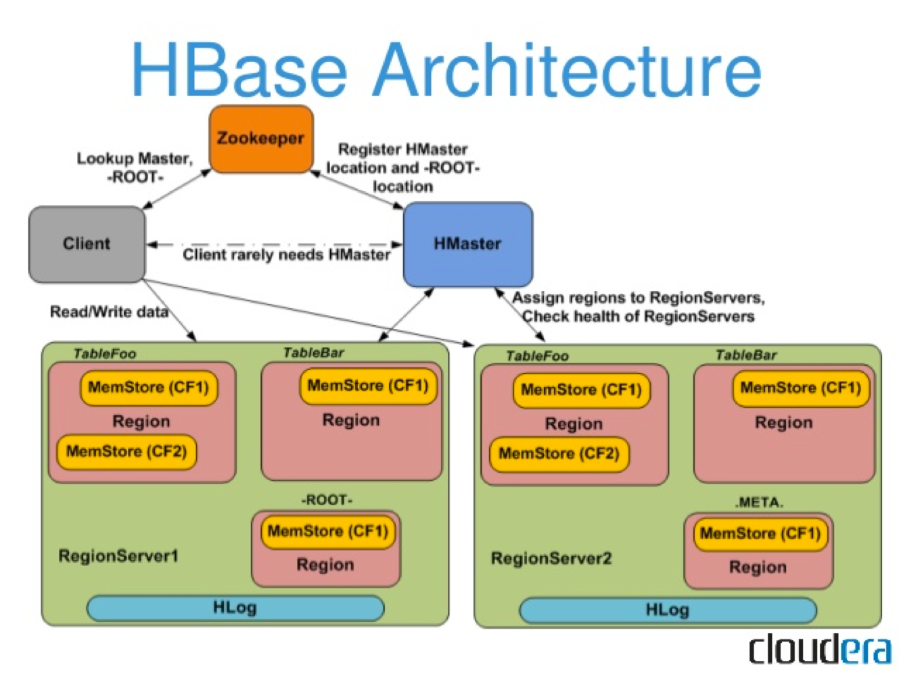
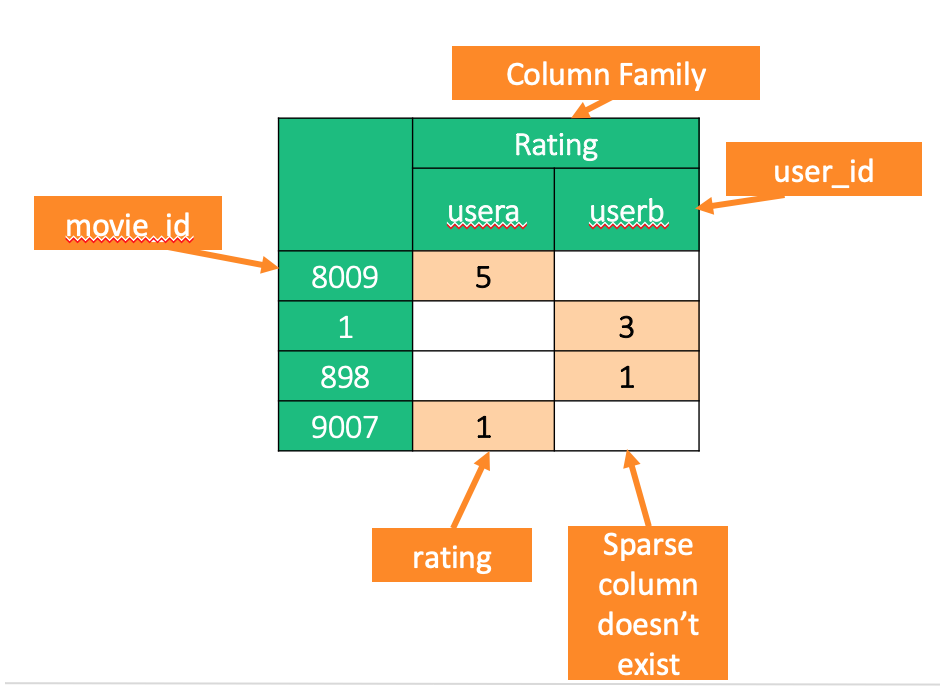
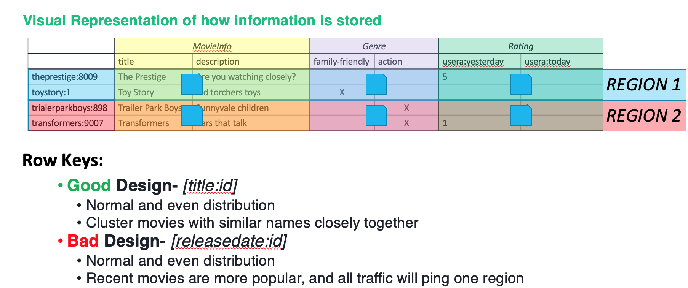

# Hadoop Databases
## Data Lakes
* Anything where we just dump our data into
* Usually a distributed file store (HDFS or S3)
* Stores unstructured or structured data, but how do we get info out of it?

## Hive
* Schema On-Read.
* Java implementation
* Runs on top of TEZ or Map-Reduce in Hadoop. Note that this is always mapping back to HDFS
* Very Light metadata store called HCatalog logs where tables are
* A Hive DDL query will modify the HCatalog; not underlying data
* Internal tables - managed by Hive. External - pulled from seperate file source.
* Intended for BATCH workloads w/long-running queries

## Impala
* C++ implementation
* Optimized for interactive querying
* Low-latency for querying over HDFS and especially over parquet.
* Made for DA/DS use-cases
* Can also run natively without YARN.
* Not geared for long-running queries/tasks

## Presto
* Java Implementation
* Presto is different in that it actually doesn't run on top of HDFS at all
* It's like Hive, if every table was an external table. Optimized for external (non-HDFS) storage systems.
* Can pull data over JDBC, ODBC, ORC, Parquet, etc and do operations.
* There's an API for readers & writers to expose the parallelism of the underlying system
* Presto shovels data in-memory from machine to machine.
* 
* Talk: https://www.youtube.com/watch?v=Z2C-iYNm2wU

## HBase (wide-columnar store)
* Doesn't run on top of YARN; just HDFS
* HBase uses HDFS to solve the data-storage resilency problem.
* Non-Relational DB built in Java and based off of Google Big Table
* Java Native. You SHOULD talk to HBase with Java Client; not JDBC.
* Use-Case: You have to scrape PBs worth of data off the internet
### Components
* Regions: Ranges of keys (not geographic). Like shards or partitions.
* ZooKeeper: Who watches the watcher?
* HMaster: the watcher responsible for region redistribution (auto sharding). Not a choke point, but a single-source of failure.
* Client: Talks to regions directly; rarely talks to HMaster.
* 
### Atonomy of a Table
* Columns can be grouped on column-families
* Column values can be versioned.
* Very sparse storage (which is what you would expect if you're scraping the web)
* 

### Design Example
* primary key selection is important. It's like a Key-Value store with auto-sharding
* From my slides on "I <3 dbs" presentation
* 
